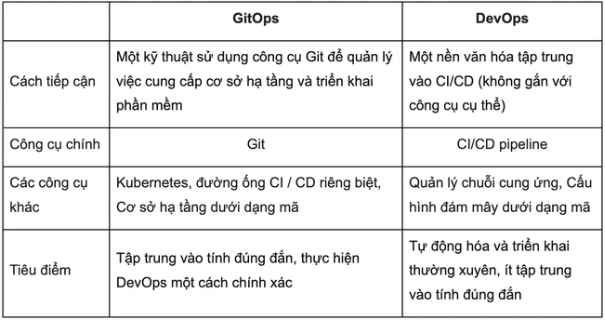

# What
- GitOps là một mô hình hoặc một tập hợp các phương pháp hay nhất của DevOps được sử dụng để phát triển ứng dụng như kiểm soát phiên bản, cộng tác, tuân thủ nguyên tắc, công cụ CI/CD và áp dụng chúng cho tự động hóa cơ sở hạ tầng. 
- Ý tưởng chính của GitOps là sử dụng Git để lưu trữ cấu hình toàn bộ cơ sở hạ tầng triển khai hoàn chỉnh cho một ứng dụng. Một tập hợp các file, sử dụng IAC , được sử dụng để phân bổ các tài nguyên cơ sở hạ tầng cần thiết, để định cấu hình việc triển khai và đảm bảo quá trình thực thi linh hoạt.

# How
- GitOps yêu cầu ba thành phần cốt lõi:
    **`GitOps = IaC + MRs + CI/CD`**
- IaC: GitOps sử dụng kho lưu trữ Git làm source of truth duy nhất cho các định nghĩa cơ sở hạ tầng. Git là một hệ thống kiểm soát phiên bản mã nguồn mở theo dõi các thay đổi quản lý code và kho lưu trữ Git là một thư mục .git trong một dự án theo dõi tất cả các thay đổi được thực hiện đối với các tệp trong một dự án theo thời gian. Cơ sở hạ tầng dưới dạng mã (Infrastructure as Code  - IaC) là phương pháp giữ tất cả cấu hình cơ sở hạ tầng được lưu trữ dưới dạng mã. Trạng thái mong muốn thực tế có thể có hoặc không được lưu trữ dưới dạng mã (ví dụ: số lượng bản sao hoặc nhóm).

- MR: GitOps sử dụng các merge request (MR) làm cơ chế thay đổi cho tất cả các bản cập nhật cơ sở hạ tầng. MR là nơi các nhóm có thể cộng tác thông qua các đánh giá và nhận xét và là nơi xác nhận chính thức.

- CI/CD : GitOps tự động cập nhật cơ sở hạ tầng bằng quy trình làm việc Git với tích hợp liên tục (CI) và phân phối liên tục (CI/CD). Khi code mới được hợp nhất, CI/CD pipeline thực hiện sự thay đổi trong môi trường. Bất kỳ sai lệch cấu hình nào, chẳng hạn như các thay đổi hoặc lỗi, đều được ghi đè bởi tự động hóa GitOps để môi trường hội tụ về trạng thái mong muốn được xác định trong Git. GitLab sử dụng CI/CD pipeline để quản lý và triển khai tự động hóa GitOps, nhưng các hình thức tự động hóa khác, chẳng hạn như định nghĩa các operator cũng có thể được sử dụng.

# Các vấn đề liên quan đến Gitops
#### Quy trình CI và CD tách rời 
- Mục tiêu phát triển của các ứng dụng mới trong hiện nay **(modern application)** là **tự động hóa hoàn toàn, đẩy DevOps lên mức tối đa**, nơi các thay đổi đối với môi trường Production có thể được thực hiện một cách an toàn chỉ trong vài phút.

- Code được đưa vào Production qua một Pipeline, được định nghĩa là một tập hợp các bước liên quan đến việc xây dựng các entity, thực hiện các bài kiểm tra testing và bảo mật, cũng như cung cấp các tài nguyên cơ bản để chạy code.\
Có ba loại bước cổ điển: ***tích hợp****** (integration)**, **phân phối (delivery)*** và sau đó ***triển khai* *(deployment)***:

    -   **tích hợp** liên quan đến các thay đổi đối với mã, thay đổi kiểm thử vào một kho lưu trữ mã được chia sẻ
    -   **phân phối** liên quan đến việc tải code lên các môi trường định nghĩa sẵn
    -   **triển khai** là việc chuyển hệ thống ứng dụng sang sử dụng mã code mới được sử dụng bởi khách hàng cuối.

- Cách tiếp cận GitOPs để thành công đòi hỏi phải **tách riêng quá trình CI và CD,** có nghĩa là việc tích hợp và phân phối (delivery)/ triển khai (deployment) được thực hiện một cách độc lập.

#### **Khác biệt về bản chất** giữa CI/CD

-   **Tích hợp liên tục** đòi hỏi phải hiểu cách xây dựng và compile code, chạy một số công cụ sẽ phân tích code, thực hiện đẩy code compile, đóng gói kết quả vào các repository. Hoạt động này không xem xét đến môi trường thực thi mục tiêu để thực thi đúng cách.
-   Ngược lại, **triển khai liên tục** là tất cả về việc di chuyển và thực thi các tệp nhị phân phần mềm trong một môi trường thực thi. Bước này không liên quan đến bất kỳ tạo nhị phân nào nữa nhưng yêu cầu phải biết, kết nối và tương tác với môi trường thực thi. Quá trình này có khả năng làm xáo trộn quá trình thực thi của các ứng dụng hiện có đang chạy trên cùng một môi trường, hoặc gây ra lỗi hoặc sự cố môi trường thực thi (ví dụ như do thiếu tài nguyên).

Một công cụ **tích hợp liên tục** ( [Jenkins](https://www.jenkins.io/) , [CircleCI](https://circleci.com/) ...) sẽ tập trung vào việc xây dựng các ứng dụng của bạn thành các tệp nhị phân (binary), khởi tạo một quy trình phân tích phức tạp, đảm bảo mã được phân tích kỹ lưỡng để đáp ứng các nguyên tắc bảo mật của bạn.

Mặt khác, một công cụ **triển khai liên tục** , như [ArgoCD](https://argoproj.github.io/argo-cd/) , [Spinnaker](https://spinnaker.io/) và [Flux CD](https://github.com/fluxcd/flux) sẽ tập trung vào việc triển khai hiệu quả khối lượng công việc của bạn, bao gồm các pattern triển khai nâng cao như triển khai **blue/ green, canary.** Các công cụ này cũng sẽ giúp bạn dễ dàng quay trở lại các lần triển khai trước đó nếu có sự cố trong quá trình thực hiện. Một công cụ CD cũng sẽ giám sát hệ thống để ngăn chặn sự [trôi dạt cấu hình](https://www.hashicorp.com/resources/how-can-i-prevent-configuration-drift/) **(configuration driff)**

# Push và Pull
Có hai cách để triển khai quy trình CD, tùy thuộc vào người đang yêu cầu triển khai: **PUSH so với PULL**

Cách tiếp cận đầu tiên và đơn giản hơn là dựa trên **mô hình push** trong đó yêu cầu triển khai **(deployment request)** được tạo bởi Git. Trong mô hình này, khi kho cơ sở hạ tầng của bạn đang được thay đổi, điều này sẽ kích hoạt một tác vụ (task hoặc job) sẽ xem xét các thay đổi và triển khai hoặc loại bỏ chúng.

Quá trình này tương tự như một Công việc CI. Công việc triển khai chỉ được kích hoạt khi thực hiện thay đổi đối với kho lưu trữ.

Cách tiếp cận này sẽ hoạt động hầu hết thời gian, nhưng nó có hai sai sót:

-   việc triển khai chỉ được thực thi khi kho lưu trữ Git được sửa đổi. Nếu vì bất kỳ lý do gì, hệ thống đích đi chệch khỏi kho lưu trữ Git, điều này sẽ không được thay đổi cho đến lần commit tiếp theo trên Git.
-   về cơ bản mô hình này bắt chước một quy trình CI và thường được sử dụng khi một công cụ bên ngoài thực hiện việc triển khai. Trong trường hợp này, bạn sẽ cần cung cấp cho công cụ CD của mình tất cả thông tin đăng nhập cần thiết để triển khai ứng dụng trên hệ thống đích. Điều này có thể tạo ra một lỗ hổng bảo mật.

Sự khác biệt chính so với **mô hình push** là bây giờ công cụ CD sẽ theo dõi cả sự thay đổi giữa trạng thái mong muốn (trên Git repo) và trạng thái thực tế (hệ thống đích) và đảm bảo rằng trạng thái thực tế vẫn phù hợp với trạng thái mong muốn.

Điều này tránh để hệ thống đi chệch khỏi trạng thái mong muốn theo những cách không kiểm soát được. Ví dụ: nếu một ai đó đang thực hiện thay đổi trực tiếp trên cơ sở hạ tầng do nhầm lẫn, điều này sẽ bị Công cụ CD xác định và chuyển trở lại trạng thái mong muốn được mô tả trong Git repo.

Về cơ bản, đây là điều làm cho một công cụ CD chuyên dụng khác với một Công cụ CI cổ điển như Jenkins chủ yếu thực hiện mô hình đẩy.

**mô hình pull** nên được đề xuất để nhận được đầy đủ lợi ích của GitOps:

-   khi các nền tảng thực thi có thể lập trình được sử dụng (như Kubernetes hoặc Openshift...)
-   khi bạn chọn công cụ mới như [**ArgoCD**](https://argoproj.github.io/argo-cd/) , [**Spinnaker**](https://spinnaker.io/)** ,** và [**FluxCD**](https://github.com/fluxcd/flux)** .**

# GitOps khác DevOps như thế nào?
- GitOps và DevOps có chung một số nguyên tắc và mục tiêu. DevOps là về sự thay đổi văn hóa và cung cấp một cách để các nhóm phát triển và nhóm vận hành làm việc cùng nhau một cách hợp tác.

- GitOps cung cấp cho bạn các công cụ và khuôn khổ để thực hiện các phương pháp DevOps, như cộng tác, CI/CD và kiểm soát phiên bản, đồng thời áp dụng chúng cho tự động hóa cơ sở hạ tầng và triển khai ứng dụng. 

# Tham khảo
- https://cloudgeeks.net/gitops-la-gi-tim-hieu-ve-gitops-va-loi-ich-cua-no/