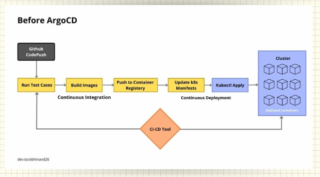
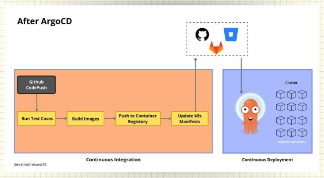

ArgoCD Existence, Why 🤔?
=========================

There are already hell lots of tools in the market, so why do we need another one? To justify the existence of ArgoCD, let's try to understand the workflow for application deployment before-and-after ArgoCD.

Workflow Before ArgoCD
------------------------------------------------------------------------------------------------------------------

Before the existence of ArgoCD, the pipeline seems something like the image above. A common ci-cd tool is used for both the Continuous Integration and Continuous Deployment.

-   once the code is being pushed to version-control let's say Github, the tool triggers the other jobs
-   it runs the test-cases, build images, push the image to respective container registry
-   then changes the deployment manifests as per the new image build, and then deploy the new manifest using `kubectl` commands

All these jobs/tasks are being performed by a ci-cd tool. This is how traditional ci-cd workflow works before the existence of ArgoCD. However there are some challenges in this workflow.

-   We need to install and configure tools like kubectl, helm, etc in the ci-cd tools
-   We will have to provide access to k8s cluster and cloud providers if using managed services like eks to the respective ci-cd tool
-   It may lead to security loopholes as credentials are provided to external tools
-   There's no visibility of deployment metrics, your ci-cd tools doesn't know the status of deployed application once they apply the manifests

Workflow After ArgoCD
----------------------------------------------------------------------------------------------------------------

After the ArgoCD was launched in the market, the complete workflow has been changed. As you can see in the image, the Continuous Integration and Continuous Deployment has been separated now. ArgoCD uses declarative GitOps based deployment which states that the best practices is to have two different git repositories, one for application source code and another for deployment manifest files.

-   once the code has been pushed to version, the CI pipeline trigger the job
-   starts to run test cases, build images, push images to respective container registry and then update the manifest according and push manifests to its respective git repository
-   once the updated manifests is pushed to its respective repository be it Github, Gitlab, etc as shown in the image, ArgoCD installed within the cluster automatically checks for the updates and apply within the cluster.

This is how, the respective ci-cd tool is limited to CI and ArgoCD handles the CD part and thus separating both the operations. There are many different advantages of using this workflow, some of them are -

-   it uses git as a single source of truth, thus incorporating GitOps principles for the deployment
-   since ArgoCD is installed within the cluster and is the only one that makes changes within the cluster, it doesn't require any extra credentials unlike the case of a ci-cd tool
-   ArgoCD provides a dashboard to manage all the deployed applications hence enables you to get the status of application being deployed or not which we doesn't get in case of previous workflow
-   easy rollback, as the cluster is synced with a separate git repository so we just need to revert the changes in git and the cluster will be automatically synced with the git repository
-   disaster recovery, as in case of any disaster you just need to point the git repository to the newly created cluster and it will have all the configurations of the previous cluster

So, these are some of the major advantages of the Workflow after ArgoCD. Now let's dive into ArgoCD and do some practical stuffs.

# Reference
- https://dev.to/abhinavd26/all-about-argocd-a-beginners-guide-33c9