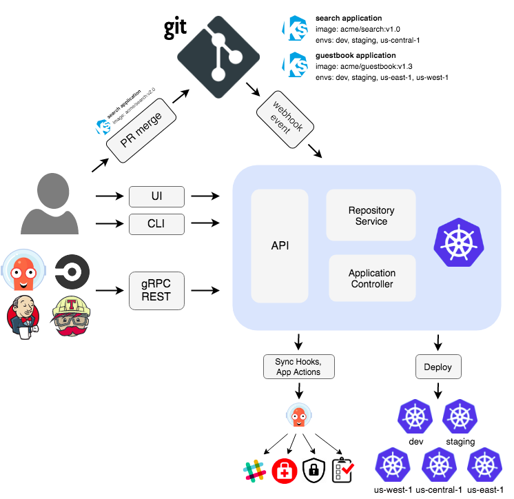

### What
Một cách đơn giản, ArgoCD là một công cụ mang tính khai báo, một công cụ giúp triển khai/phân phối liên tục cho `Kubernetes`.

Không giống các tool CD khác triển khai dựa trên `push` thì ArgoCD hỗ trợ cơ chế `pull` để update code từ Git repogistory và đẩy trực tiếp lên Kubernetes cluster.

Một vài key feature của ArgoCD:
- Manual or automatic deployment ứng dụng tới Kubernetes cluster
- Tự động đồng bộ trạng thái của application với current version của cấu hình khai báo.
- Web user interface and command-line interface
- Khả năng quan sát các vấn đề khi triển khai, phát hiện và khắc phục các sự cố liên quan đến configuration drift
- RBAC khả dụng cho multi-cluster
- Tích hợp được SSO (Keycloak, gitlab, github,...)
- Hỗ trợ Webhook trigger action với Gitlab, github, bitbucket,.

### How does ArgoCD work

- Khi sử dụng ArgoCD, bạn có thể sử dụng một số loại Kubernetes manifests: YAML or JSON manifests, HELM charts, Kustomize; and Ksonnet and Jsonnet applications. 
- ArgoCD sẽ tự động triển khai trạng thái mong muốn của ứng dụng lên một môi trường cụ thể. Nó liên tục so sánh trạng thái trực tiếp của ứng dụng với trạng thái mong muốn được chỉ định trên Git repogisory. Nếu trạng thái của ứng dụng đang chạy bị lệch khỏi trạng thái mong muốn thì nó sẽ báo `OutOfSync`. ArgoCD sẽ báo cáo các sai lệch và cung cấp một giao diện trực quan hóa để giúp các developer đồng bộ trạng thái một các thủ công hay tự động.
- Argo CD có thể tự động áp dụng bất kỳ thay đổi nào đối với trạng thái mong muốn trong kho lưu trữ Git cho môi trường đích, đảm bảo các ứng dụng vẫn đồng bộ.

**Basic Component**

*API Server*
- Exposes the API for the WebUI, CLI and other integrations.
Responsibilities: 
    - application management and status reporting
    - invoking of application operations (e.g. sync, rollback, user-defined actions)
    - repository and cluster credential management (stored as K8s secrets)
    - authentication and auth delegation to external identity providers
    - RBAC enforcement
    - listener/forwarder for Git webhook events

*Repository Server*

- The repository server is an internal service which maintains a local cache of the Git repository holding the application manifests. It is responsible for generating and returning the Kubernetes manifests when provided the following inputs:

    -   repository URL
    -   revision (commit, tag, branch)
    -   application path
    -   template specific settings: parameters, helm values.yaml

*Application Controller*

- The application controller is a Kubernetes controller which continuously monitors running applications and compares the current, live state against the desired target state (as specified in the repo). It detects `OutOfSync` application state and optionally takes corrective action. It is responsible for invoking any user-defined hooks for lifecycle events (PreSync, Sync, PostSync)

Ngoài các thành phần cơ bản trên, ArgoCD cũng có 2 thành phần sau: 
    - `Redis & Dex-Server`: Redis được sử dụng như một cache service và có thể bị mất và được xây dựng lại mà không làm mất dịch vụ. `dex server` là một dịch vụ nhận dạng sử dụng OpenID Connect để tích hợp xác thực cho các ứng dụng khác.

# Tham khảo
- https://codefresh.io/learn/argo-cd/#:~:text=Argo%20CD%20is%20a%20Kubernetes%20controller%2C%20responsible%20for%20continuously%20monitoring,the%20desired%20state%20as%20OutOfSync.
- https://argo-cd.readthedocs.io/en/stable/operator-manual/architecture/