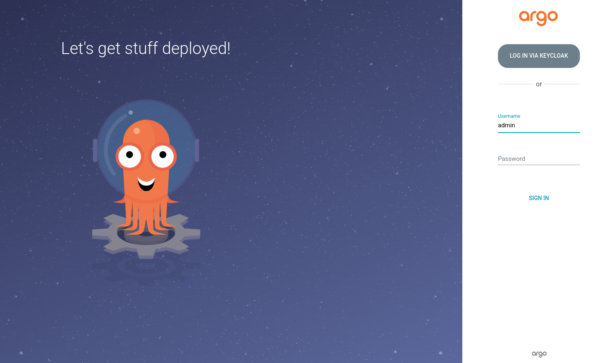

ArgoCD hỗ trợ 2 loại cài đăt: 
- None HA: không recommend khi sử dụng trên môi trường production.
    -   [install.yaml](https://github.com/argoproj/argo-cd/blob/master/manifests/install.yaml) - Standard Argo CD installation with cluster-admin access. Use this manifest set if you plan to use Argo CD to deploy applications in the same cluster that Argo CD runs in (i.e. kubernetes.svc.default). It will still be able to deploy to external clusters with inputted credentials.

    -   [namespace-install.yaml](https://github.com/argoproj/argo-cd/blob/master/manifests/namespace-install.yaml) - Installation of Argo CD which requires only namespace level privileges (does not need cluster roles). Use this manifest set if you do not need Argo CD to deploy applications in the same cluster that Argo CD runs in, and will rely solely on inputted cluster credentials. An example of using this set of manifests is if you run several Argo CD instances for different teams, where each instance will be deploying applications to external clusters. It will still be possible to deploy to the same cluster (kubernetes.svc.default) with inputted credentials (i.e. `argocd cluster add <CONTEXT> --in-cluster --namespace <YOUR NAMESPACE>`).
- HA: Recommend for production, gói này bao gồm các thành phần giống nhau nhưng được điều chỉnh để có tính khả dụng và khả năng phục hồi cao.
    -   [ha/install.yaml](https://github.com/argoproj/argo-cd/blob/master/manifests/ha/install.yaml) - the same as install.yaml but with multiple replicas for supported components.

    -   [ha/namespace-install.yaml](https://github.com/argoproj/argo-cd/blob/master/manifests/ha/namespace-install.yaml) - the same as namespace-install.yaml but with multiple replicas for supported components.

Cài đặt đơn giản:
```
kubectl apply -n argocd -f https://raw.githubusercontent.com/argoproj/argo-cd/stable/manifests/ha/install.yaml
```
Ingress configuration:
```
apiVersion: networking.k8s.io/v1
kind: Ingress
metadata:
  name: argocd-server-ingress
  namespace: argocd
  annotations:
    cert-manager.io/cluster-issuer: letsencrypt-prod
    kubernetes.io/ingress.class: nginx
    kubernetes.io/tls-acme: "true"
    nginx.ingress.kubernetes.io/ssl-passthrough: "true"
    # If you encounter a redirect loop or are getting a 307 response code 
    # then you need to force the nginx ingress to connect to the backend using HTTPS.
    #
    nginx.ingress.kubernetes.io/backend-protocol: "HTTPS"
spec:
  rules:
  - host: argocdUrl
    http:
      paths:
      - path: /
        pathType: Prefix
        backend:
          service:
            name: argocd-server
            port:
              name: https
  tls:
  - hosts:
    - argocdUrl
```

Lấy password mặc định khi cài đặt:
```
kubectl -n argocd get secret argocd-initial-admin-secret -o jsonpath="{.data.password}" | base64 -d; echo
```

Truy cập vào URL của ArgoCD và đăng nhập với username `admin` và password lấy được từ bước trước, sau đó bạn nên update lại password



