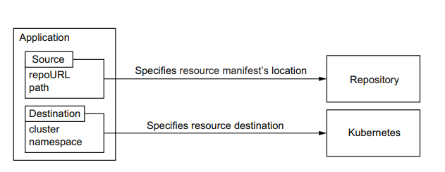
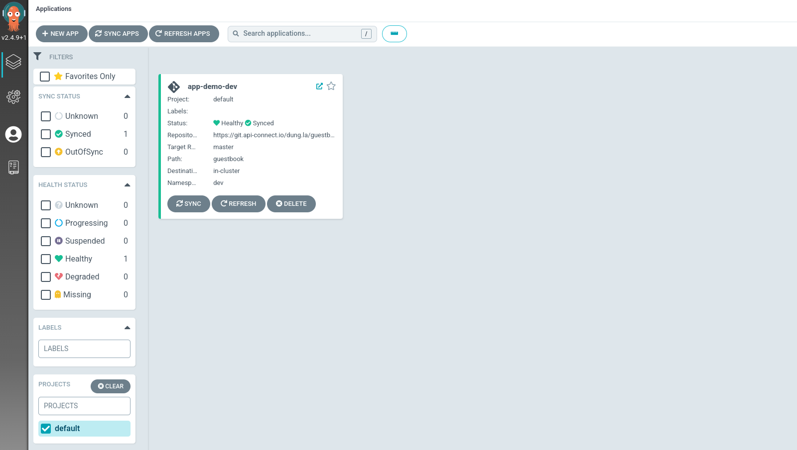

ArgoCD có 2 basic concept là Application và Project.
### 1. Application
- Application cung cấp một logical group các tài nguyên K8s và định nghĩa nguồn và đích của resource manifest


- `Source application` bao gồm repository URL và thư mục bên trong của repo. Repo này sẽ bao gồm nhiều thư mục, mỗi ứng dụng sẽ tương đương với 1 môi trường tiển khai như QA and Prod. Cấu trúc thư mục bên trong repo như sau:
```
.
├── iping-website
│   │   ├── dev
│   │   │   ├── Chart.yaml
│   │   │   └── values.yaml
│   │   ├── prod
│   │   │   ├── Chart.yaml
│   │   │   └── values.yaml
│   │   ├── stg
│   │   │   ├── Chart.yaml
│   │   │   └── values.yaml
│   │   └── uat
│   │       ├── Chart.yaml
│   │       └── values.yaml

```

Mỗi thư mục không nhất thiết phải chứa các tệp YAML thuần túy. ArgoCD hỗ trợ nhiều định dạng cấu hình nên thư mục cũng có thể chứa định nghĩa Helm chart hay Kustomize.

- `Destination Application`: xác định nơi resource phải được triển khai bao gồm API Server URL của K8s cluster cùng với namespace. 

Như vây, Application là đại diện cho một môi trường triển khai trên k8s cluster và kết nối nó với trạng thái mong muốn được khai báo trên Git repo

### Cách tạo một application
1. Tạo bằng manifest file sử dụng CRDs của argoCD (*recommend*)
```
apiVersion: argoproj.io/v1alpha1
kind: Application
metadata:
  labels:
    env: dev
    project: copen
    createBy: dungla
  name: your_app_name
  namespace: argocd
spec:
  destination:
    namespace: your_namespace
    server: your_k8s_cluster_api
  project: copen
  source:
    path: path_to_config
    repoURL: git_repo
    targetRevision: master
  syncPolicy:
    automated:
      prune: true
      selfHeal: true
    syncOptions:
    - CreateNamespace=true
```
Tham khảo các tham số khi tạo Application tại [đây](https://argo-cd.readthedocs.io/en/stable/operator-manual/application.yaml)


2. Tạo thông qua WebUI
- Tham khảo cách tạo Application bằng UI tại [đây](https://medium.com/@outlier.developer/getting-started-with-argocd-for-gitops-kubernetes-deployments-fafc2ad2af0)

3. Tạo thông qua CLI
```
# argocd login URL_ArgoCD --username username --password 'password' --grpc-web 
# argocd app create guestbook \                                                                
--repo https://git.api-connect.io/dung.la/guestbook.git \
--path guestbook \
--dest-server https://kubernetes.default.svc \
--dest-namespace guestbook
```

Kết quả:


# Tham khảo
- https://www.devopsschool.com/blog/sync-options-in-argo-cd/
- https://argo-cd.readthedocs.io/en/stable/operator-manual/declarative-setup/