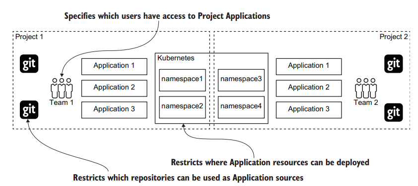
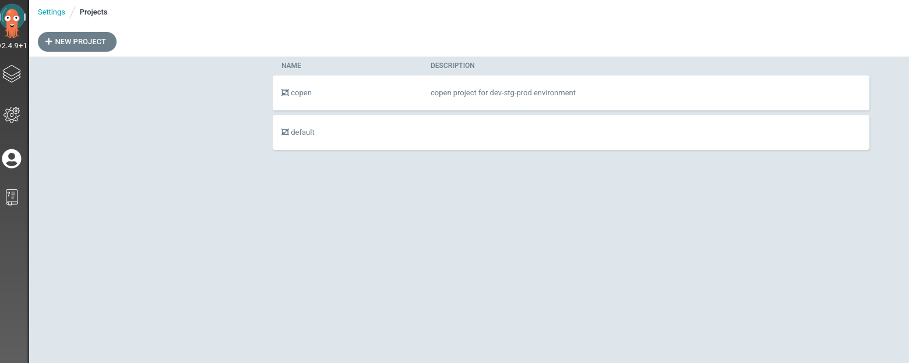

Tiếp nối ở bài trước, bài này sẽ giới thiệu về core concept thứ 2 của ArgoCD chính là `Project`
### 2. Project
- ArgoCD Application cung cấp một cách linh hoạt để quản lý các ứng dụng khác nhau trên các môi trường khác nhau. Tuy nhiên điều này không đủ đễ hỗ trợ nhiều team với các cấp độ truy cập khác nhau:
  - Danh sách các ứng dụng hỗn hợp tạo ra sự nhầm lẫn dẫn đến khả năng xảy ra lỗi của con người.
  - Các team khác nhau có các cấp độ truy cập khác nhau. Một cá nhân có thể sử dụng Gitops Operator để báo cáo quyền của riêng họ để có được toàn quyền truy cập cụm.
- ArgoCD giới thiệu khái niệm `Project` để giải quyết các vấn đề trên. Môt Project cung cấp một nhóm logical các Application, cô lập giữa các team và cho phép điều khiển truy cập vào mỗi Project.



Ngoài việc tách các nhóm Application, một Project còn cung cấp:
- Hạn chế các K8s cluster và Git Repository có thể được sử dụng bởi Project Application.
- Hạn chế tài nguyên Kubernetes có thể được triển khai bởi mỗi Application trong một Project

### Tạo Project
- Tương tự như Application, tạo Project sẽ có các cách sau:

1. Tạo thông qua manifest file (*recommend*)
```
apiVersion: argoproj.io/v1alpha1
kind: AppProject
metadata:
  name: copen
  namespace: argocd
  finalizers:
    - resources-finalizer.argocd.argoproj.io
spec:
  description: "your description"
  sourceRepos:
  - '*'
  destinations:
  - namespace: '*'
    server: your_k8s_cluster_api
  - namespace: '*'
    server: your_k8s_cluster_api
  clusterResourceWhitelist:
  - group: '*'
    kind: '*'
  namespaceResourceWhitelist:
  - group: "*"
    kind: "*"
  roles:
#define roles here
  orphanedResources:
    warn: true
```

Tham khảo thêm các parameter tại [đây](https://argo-cd.readthedocs.io/en/stable/operator-manual/project.yaml)

2. Tạo thông qua WebUI
- Tham khảo cách tạo Project bằng UI tại [đây](https://medium.com/@outlier.developer/getting-started-with-argocd-for-gitops-kubernetes-deployments-fafc2ad2af0)

3. Tạo thông qua CLI
```
# argocd login URL_ArgoCD --username username --password 'password' --grpc-web 
# argocd proj create myproject -d https://kubernetes.default.svc,mynamespace -s https://github.com/argoproj/argocd-example-apps.git
```

Kêt quả: 



# Tham khảo
https://argo-cd.readthedocs.io/en/stable/operator-manual/declarative-setup/